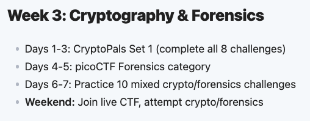

# Cryptography Notes – Cybersecurity

This repository contains my notes and code for Cryptography,
based on The Roadmap Set

## Contents
- [Day 1](Day1-3/day1-encoding.md): Hex, Base64, Encoding
- [Day 2](Day1-3/day2-xorEncryption.md): XOR Encryption
- [Day 3](): Repeating-key XOR

## Tools Used
- Python 3
- CyberChef
- CryptoPals
